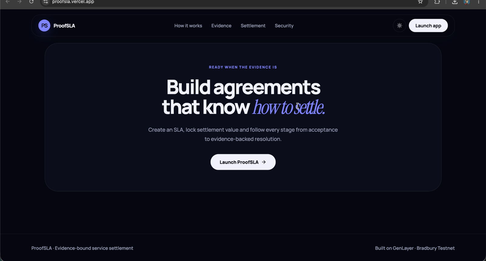
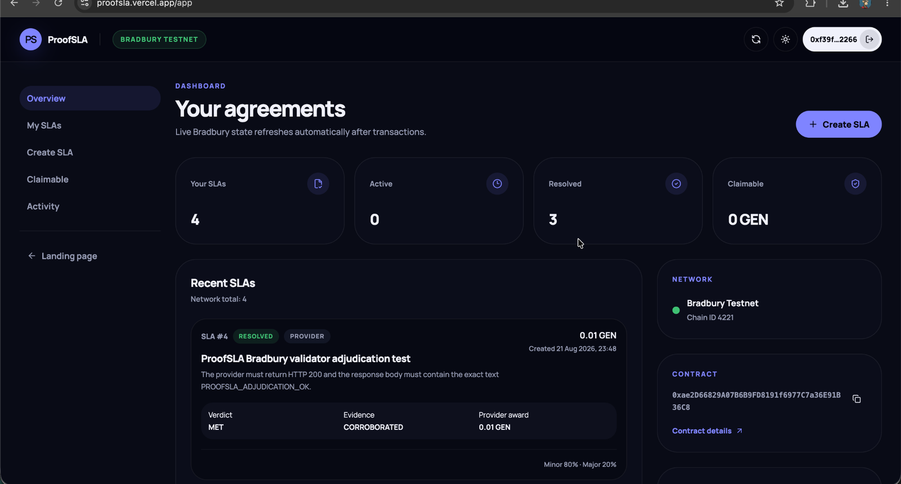
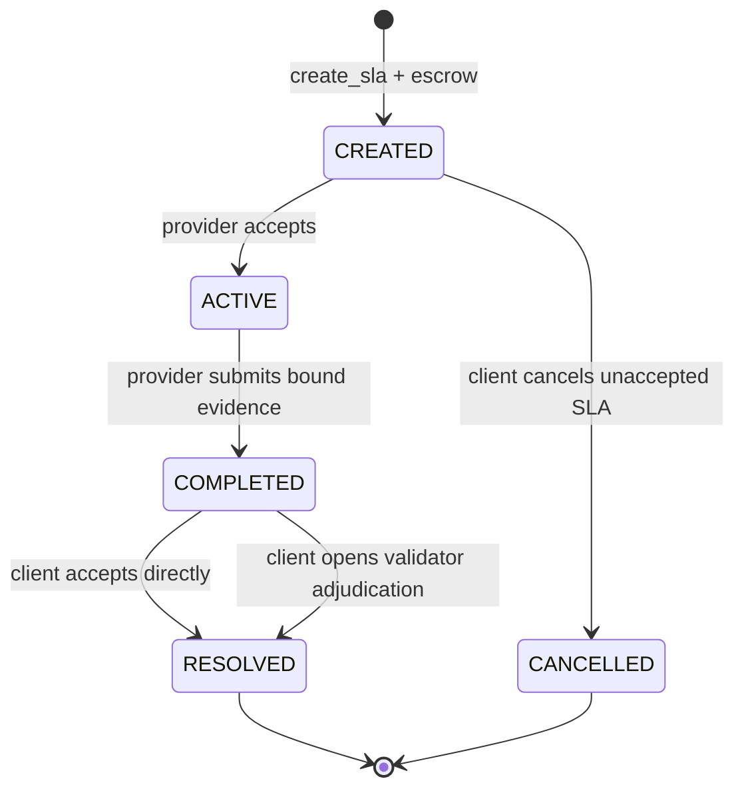
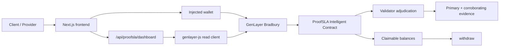

# ProofSLA

**Evidence-bound SLA settlement for AI/API service executions on GenLayer.**

ProofSLA lets a client lock GEN against an immutable service agreement, lets a
provider submit hash-bound execution evidence, and lets GenLayer validators
adjudicate the result before deterministic settlement.

[**Live app**](https://proofsla.vercel.app) ·
[**v1 specification**](docs/SPEC_V1.md) ·
[**Bradbury live verification**](docs/BRADBURY_LIVE_VERIFICATION.md) ·
[**Architecture**](docs/ARCHITECTURE.md)




## Why ProofSLA

Service agreements often describe measurable outcomes, but settlement still
depends on manual interpretation, mutable screenshots, or a single party's
claim. ProofSLA turns that workflow into an explicit on-chain lifecycle:

1. the client defines the service and measurable requirements;
2. the client escrows GEN;
3. the provider accepts the immutable SLA;
4. the provider submits primary and corroborating HTTPS evidence plus SHA-256
   digests and an observation time;
5. the client either accepts delivery directly or opens GenLayer adjudication;
6. the contract applies the configured deterministic payout policy.

The contract separates **evidence interpretation** from **fund movement**:
validators determine the settlement-relevant verdict/evidence status, while the
contract deterministically calculates the awards.

## Live deployment

| Item | Value |
| --- | --- |
| Production app | https://proofsla.vercel.app |
| Network | GenLayer Bradbury Testnet |
| Chain ID | `4221` |
| Contract | `0xae2D66829A07B6B9FD8191f6977C7a36E91B36C8` |
| Deployment transaction | `0xc0146846c7ff84723ba42e4cfaee3d829d5b8be1e76066c68d4dcb0c15f76228` |
| Verified contract source SHA-256 | `7bc3b90343eacad03ec6db92fe64333f314a4bb75b85bd9a209ca1a3e1707075` |
| Production frontend commit | `60d4a0150be7ae93469d24b54950bde1da065044` |
| Explorer | https://explorer-bradbury.genlayer.com/ |

Bradbury is a test network. The live app should not be described as a mainnet
or production-financial deployment.

## Product walkthrough

### 1. Start from the service agreement

The landing experience explains the evidence-bound settlement model before the
user enters the application.


### 2. Track live Bradbury agreements

The dashboard reads the deployed contract, filters the user's agreements, and
shows lifecycle state, verdict, evidence status, awards, claimable GEN, network
information, and transaction activity.



A completed SLA deliberately presents two different client actions:

- **Adjudicate with validators** — runs the evidence-bound GenLayer
  adjudication path.
- **Accept without review** — intentionally skips validator review and settles
  the delivery as `MET / CORROBORATED`.

See [Product Walkthrough](docs/PRODUCT_WALKTHROUGH.md) for the full application
flow.

## SLA lifecycle



Application states are intentionally separate from GenLayer transaction states.
`ACCEPTED` and `FINALIZED` describe transaction consensus/finality; they are not
SLA lifecycle states.

## Settlement policy

The client chooses the provider share for minor and major breach at SLA
creation. The major-breach provider share cannot exceed the minor-breach share.

| Verdict | Provider award | Client award |
| --- | ---: | ---: |
| `MET` | 100% | 0% |
| `MINOR_BREACH` | configured minor provider share | remainder |
| `MAJOR_BREACH` | configured major provider share | remainder |
| `INSUFFICIENT_EVIDENCE` | 0% | 100% |

Validator output also includes:

- `evidence_status`: `CORROBORATED`, `CONFLICTING`, or `INSUFFICIENT`
- a brief free-form reason

If evidence is not `CORROBORATED`, the contract normalizes settlement to
`INSUFFICIENT_EVIDENCE`.

Awards are credited to pull-payment balances. Users withdraw their own
`claimable` amount with a separate `withdraw()` transaction.

## Evidence and adjudication model

Each delivery binds:

- primary evidence HTTPS URL;
- primary evidence SHA-256;
- corroboration HTTPS URL;
- corroboration SHA-256;
- evidence observation timestamp.

The two URLs must be different. Validators refetch the evidence, verify the
digests, apply the SLA freshness constraint, and reason over the immutable
service description and requirements.

Evidence content is treated as **untrusted data**, not as instructions to the
validator prompt. Validator comparison is constrained to the
settlement-relevant `verdict` and `evidence_status`; explanatory prose may
differ.

Two distinct evidence references do **not** by themselves prove organizational
or infrastructure independence. See [Security Model](docs/SECURITY_MODEL.md).

## Architecture



The browser performs wallet-authorized writes. Routine dashboard reads use a
same-origin Next.js route handler, which performs read-only GenLayer calls and
returns a JSON-safe snapshot. TanStack Query refreshes that snapshot
automatically after accepted writes and on a polling interval.

See [Architecture](docs/ARCHITECTURE.md) for the trust boundaries and transaction
flow.

## Verified behavior

### Contract gate

The reproducible contract verification gate has passed:

- Python `3.12.14`
- pinned GenLayer development dependencies
- lint checks
- semantic validation
- strict typecheck: `0 error(s), 0 warning(s)`
- fresh schema / ABI validation
- Direct Mode: **21 / 21 tests passed**
- contract source hash unchanged after the test gate

The pinned `genvm-linter` version reports a process exit status of `1` for the
strict typecheck despite the exact zero-error/zero-warning summary. The
repository verification script handles that observed version-specific behavior
explicitly rather than suppressing it generically.

### Live Bradbury path

A dedicated live SLA exercised the validator adjudication path:

- state: `RESOLVED`
- verdict: `MET`
- evidence status: `CORROBORATED`
- provider award: `0.01 GEN`
- client award: `0 GEN`

The live read returned the reason:

> Both primary and corroboration evidence records confirm HTTP 200 status and
> the exact response body text PROOFSLA_ADJUDICATION_OK for the same service
> run.

The complete evidence record is in
[Bradbury Live Verification](docs/BRADBURY_LIVE_VERIFICATION.md).

### Frontend gate

The current frontend passed:

- ESLint
- Next.js production build
- TypeScript compilation
- Playwright: **5 / 5**
- `npm audit`: **0 vulnerabilities**
- production `next start` smoke:
  - `/` → HTTP 200
  - `/app` → HTTP 200
  - `/api/proofsla/dashboard` → live Bradbury data
- Vercel production verification against the deployed Bradbury contract

See [Testing](docs/TESTING.md).

## Repository structure

```text
contracts/
  proofsla.py                         Intelligent Contract

docs/
  SPEC_V1.md                         frozen v1 behavior
  BRADBURY_LIVE_VERIFICATION.md      live-chain evidence
  ARCHITECTURE.md                    system architecture and boundaries
  DEPLOYMENT.md                      Bradbury + Vercel deployment reference
  PRODUCT_WALKTHROUGH.md             UI flow with production screenshots
  SECURITY_MODEL.md                  threat model and trust assumptions
  TESTING.md                         reproducible verification gates
  FRONTEND_PHASE_GATE.md             historical frontend gate
  evidence/                          captured verification artifacts
  assets/screenshots/                production UI screenshots

evidence/
  ...                                controlled live SLA evidence records

scripts/
  verify.sh                          reproducible contract verification gate

tests/
  ...                                Direct Mode contract suites

web/
  src/                               Next.js application
  tests/e2e/                         Playwright browser tests
  package.json                       frontend scripts and dependencies
```

## Local development

### Contract verification

Create a Python 3.12 environment and install the pinned development
requirements:

```bash
python3.12 -m venv .venv
source .venv/bin/activate
python -m pip install -r requirements-dev.txt

./scripts/verify.sh
```

The verification script is the canonical local contract gate.

### Frontend

```bash
cd web
npm ci
npm run dev
```

The application defaults to the verified Bradbury deployment. To override the
public contract address at build time:

```bash
NEXT_PUBLIC_PROOFSLA_CONTRACT_ADDRESS=0x...
```

Frontend verification:

```bash
npm run lint
npm run build
npm run test:e2e
npm audit
```

The Playwright suite mocks wallet/RPC behavior and does not create a live
Bradbury transaction.

## Intelligent Contract interface

The v1 public surface is intentionally small:

### Write methods

- `create_sla(...)`
- `accept_sla(sla_id)`
- `submit_delivery_evidence(...)`
- `accept_delivery(sla_id)`
- `adjudicate(sla_id)`
- `cancel_unaccepted_sla(sla_id)`
- `withdraw()`

### View methods

- `get_sla_count()`
- `get_sla(sla_id)`
- `get_claimable(account)`

The generated ABI is tracked in [`abi.json`](abi.json).

## Documentation

| Document | Purpose |
| --- | --- |
| [v1 Specification](docs/SPEC_V1.md) | Canonical v1 behavior and constraints |
| [Architecture](docs/ARCHITECTURE.md) | Read/write paths, state, trust boundaries |
| [Product Walkthrough](docs/PRODUCT_WALKTHROUGH.md) | User journey and production screenshots |
| [Security Model](docs/SECURITY_MODEL.md) | Evidence, prompt, wallet, and settlement risks |
| [Testing](docs/TESTING.md) | Reproducible contract/frontend verification |
| [Deployment](docs/DEPLOYMENT.md) | Bradbury contract and Vercel configuration |
| [Bradbury Live Verification](docs/BRADBURY_LIVE_VERIFICATION.md) | Live transaction and evidence record |
| [Frontend Phase Gate](docs/FRONTEND_PHASE_GATE.md) | Historical gate before UI implementation |

## Current limitations

- Bradbury Testnet only.
- Validator reasoning is nondeterministic; deterministic behavior begins at the
  contract's settlement mapping after consensus on the bounded result.
- Distinct evidence URLs do not guarantee independent organizations or
  infrastructure.
- Evidence must remain fetchable and hash-consistent when validators evaluate
  it.
- The v1 adjudication path is opened by the client.
- The frontend is optimized for the current ProofSLA v1 contract and Bradbury
  deployment; it is not a generic contract explorer.

## Contributing and security

Read [CONTRIBUTING.md](CONTRIBUTING.md) before proposing a change. Contract
changes require the full contract verification gate and must not silently
invalidate the recorded Bradbury deployment evidence.

Security-sensitive reports should follow [SECURITY.md](SECURITY.md) rather than
publishing private keys, seed phrases, or exploitable details in a public
issue.
