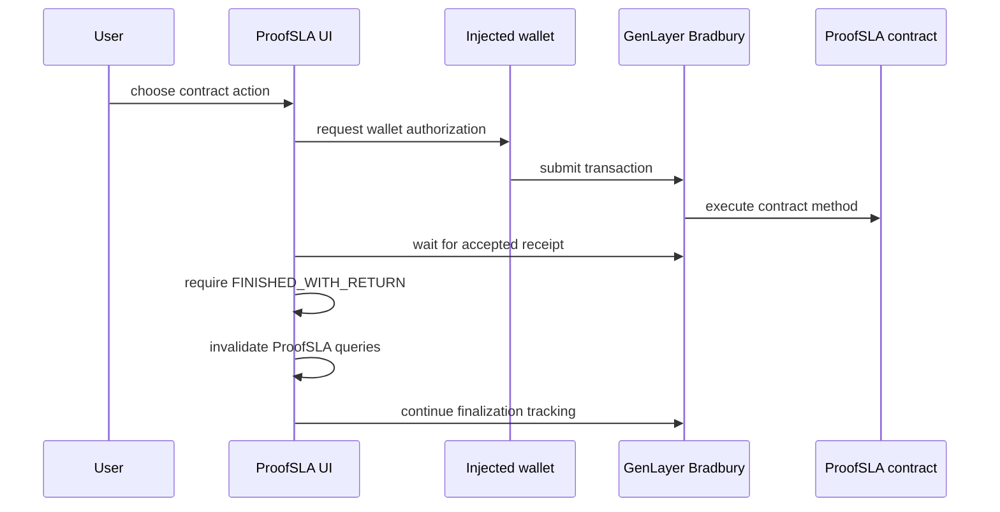
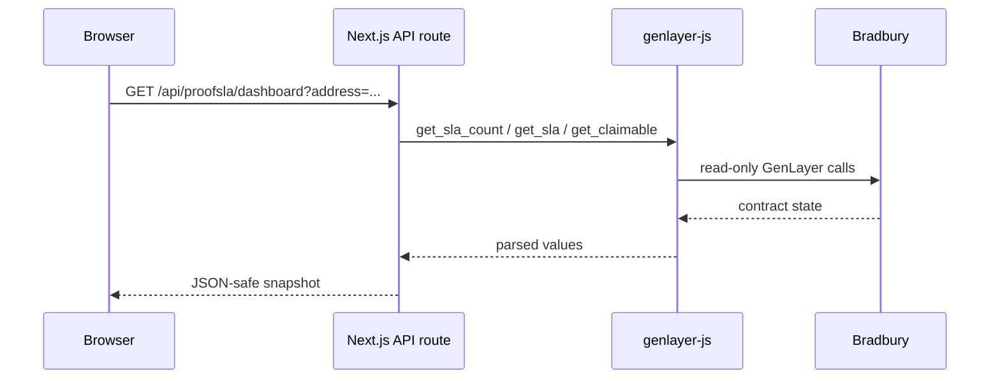

# ProofSLA Architecture

This document describes the deployed ProofSLA v1 architecture and the boundary
between deterministic contract logic, nondeterministic validator reasoning,
wallet-authorized writes, and read-only frontend infrastructure.

## Components

| Component | Responsibility |
| --- | --- |
| `contracts/proofsla.py` | SLA state, escrow accounting, evidence binding, settlement, withdrawals |
| GenLayer validators | Fetch and evaluate bound evidence during adjudication |
| `genlayer-js` | Bradbury read/write client used by the frontend |
| Injected EIP-1193 wallet | User authorization for write transactions |
| Next.js frontend | Product UI and transaction-state presentation |
| `/api/proofsla/dashboard` | Same-origin read-only Bradbury snapshot |
| TanStack Query | Client caching, polling, and post-transaction invalidation |
| Vercel | Hosts the Next.js production frontend |

## Contract state

The v1 lifecycle is:

```text
CREATED -> ACTIVE -> COMPLETED -> RESOLVED
    |
    +----> CANCELLED
```

- `CREATED`: client has created the immutable SLA and escrowed GEN.
- `ACTIVE`: provider accepted the SLA.
- `COMPLETED`: provider submitted primary/corroborating evidence.
- `RESOLVED`: delivery was accepted directly or adjudicated and settled.
- `CANCELLED`: client cancelled an unaccepted SLA and received a claimable
  refund.

These are application states. GenLayer transaction states such as `ACCEPTED`
and `FINALIZED` are deliberately not reused as SLA states.

## Write path



The UI does not treat `ACCEPTED` alone as proof of successful execution. The
transaction provider checks the execution result and rejects
`FINISHED_WITH_ERROR`.

The contract state is refreshed after accepted successful execution. For
external-value completion such as withdrawal, the UI separately tracks
finalization.

## Read path

Routine dashboard reads do not depend on browser-to-Bradbury `gen_call`.



This same-origin route avoids transient browser fetch behavior while keeping
wallet writes in the user's browser.

## Evidence path

A completed SLA stores:

- primary HTTPS URL and SHA-256;
- corroboration HTTPS URL and SHA-256;
- observation timestamp.

During adjudication, validators:

1. refetch both URLs;
2. verify their digests;
3. apply the SLA's evidence freshness constraint;
4. treat evidence as untrusted data;
5. evaluate the immutable service description and requirements;
6. return bounded settlement-relevant output.

Consensus compares `verdict` and `evidence_status`. Free-form reasons may
differ without changing the settlement result.

## Settlement path

The validator output is mapped to deterministic accounting:

```text
MET                   -> provider 100%
MINOR_BREACH          -> configured minor provider bps
MAJOR_BREACH          -> configured major provider bps
INSUFFICIENT_EVIDENCE -> provider 0%
```

Any evidence status other than `CORROBORATED` normalizes the settlement verdict
to `INSUFFICIENT_EVIDENCE`.

Awards become entries in `claimable`. No settlement path pushes value directly
to an arbitrary external recipient. `withdraw()` is a separate pull-payment
operation.

## Frontend state synchronization

After a successful accepted transaction:

1. the transaction activity entry is updated;
2. queries under the ProofSLA key are invalidated;
3. the dashboard refetches contract state;
4. polling continues periodically;
5. finalization tracking continues for the transaction lifecycle.

This is why successful live tests did not require manual page reloads.

## Trust boundaries

### Deterministic

- lifecycle transitions;
- caller authorization;
- escrow amounts;
- payout basis-point arithmetic;
- claimable accounting;
- withdrawal bookkeeping;
- evidence URL/digest storage;
- normalization of non-corroborated evidence to insufficient evidence.

### Nondeterministic

- remote evidence availability;
- LLM reasoning over the evidence;
- validator consensus timing and result.

ProofSLA intentionally makes the nondeterministic result small and bounded
before it enters deterministic settlement logic.

## Deployment boundary

The current production frontend targets the already-verified Bradbury contract:

`0xae2D66829A07B6B9FD8191f6977C7a36E91B36C8`

Frontend changes must not be described as contract upgrades. A contract change
requires a separate deployment and a fresh verification/evidence record.
